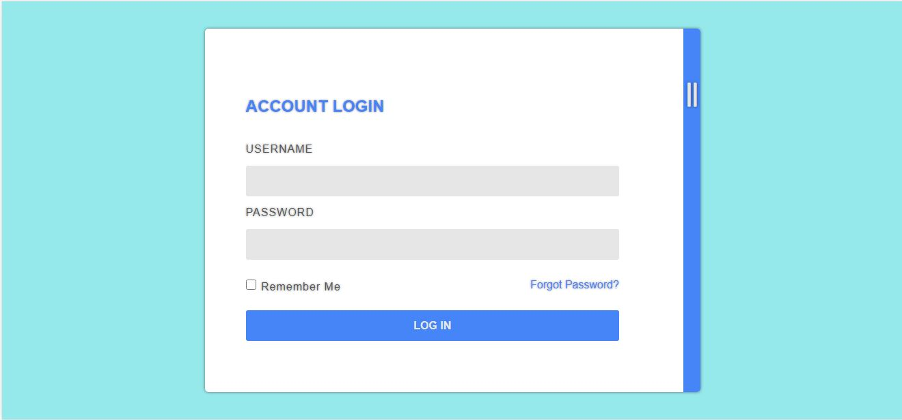
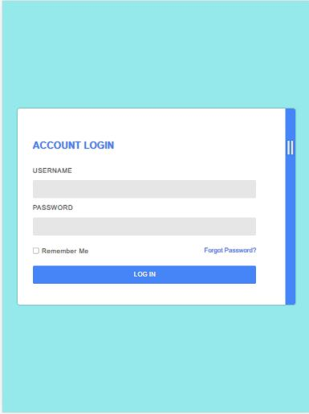
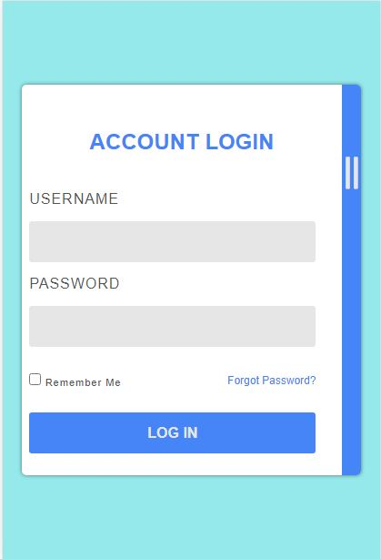
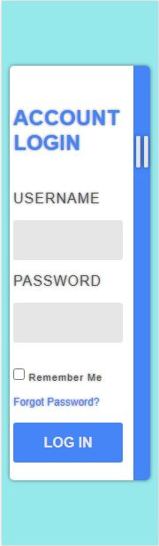

# Login_page
This is a task from Uncle BB and friends challenge 1
# Uncle BigBay and friends - login form Solution


## Table Of Contents

- [Overview](#overview)
  - [The challenge](#the-challenge)
  - [Screenshot](#screenshot)
  - [Links](#links)
- [My process](#my-process)
  - [Built with](#built-with)
  - [What I learned](#what-i-learned)
  - [Continued development](#continued-development)
  - [Useful resources](#useful-resources)
- [Author](#author)
- [Acknowledgments](#acknowledgments)


## Overview

### The challenge

Users should be able to:
- Input their data into the input boxes
- Recover their passwords in case they forgot
- Login without inputing their passwords for the second time, using the remember me      checkbox
- View the optimal layout for the site depending on their device's screen size

### Screenshot







### Links

- Solution URL: [Github](https://github.com/Austinet/Login_page.git)
- Live Site URL: [Live site](https://austinet.github.io/Login_page/)

## My process

### Built with

- Semantic HTML5 markup
- CSS custom properties
- CSS Flexbox
- Laptop-first workflow
- Visual Studio Code


### What I learned
   I practicalized using flexbox once more, and I am getting better with each project completed

```html
<div class="form">
   <form method="post">
     <label for="userName"> USERNAME </label>
     <input type="text" name="userName" id="userName">
</div>
```
```css
 body{
   width:100%;
   height:100vh;
   background:#96e9eb;
 }

```

### Continued development

Keep taking up projects and keep improving

### Useful resources

- [ Youtube](https://www.Youtube.com) 
- [Google  ](https://www.Google.com) 

## Author

- Frontend Mentor - [@austinet](https://www.frontendmentor.io/profile/austinet)
- Twitter - [@udhe.austine](https://www.twitter.com/udhe.austine)


## Acknowledgments

I will like to acknowledge God for giving me the grace to keep up with the good work.And also thanking my colleagues at Uncle BB and friends. And also Google, Youtube and ctrl+z lol.
